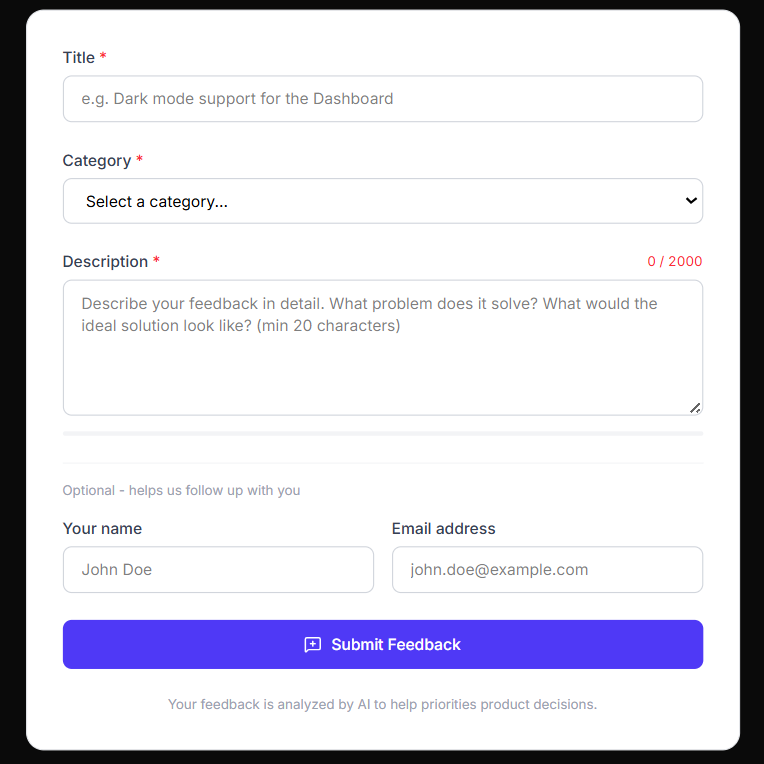
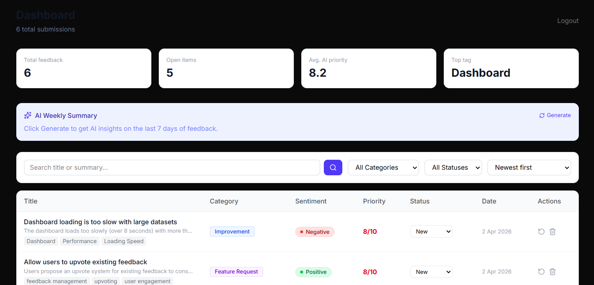

# FeedPulse — AI-Powered Product Feedback Platform

FeedPulse is a full-stack internal tool that lets teams collect product feedback and feature requests, then uses Google Gemini AI to automatically categorise, prioritise, and summarise them — giving product teams instant clarity on what to build next.

---

## Screenshots





---

## Tech Stack

| Layer | Technology |
|-------|-----------|
| Frontend | Next.js 14, React, TypeScript, Tailwind CSS |
| Backend | Node.js, Express, TypeScript |
| Database | MongoDB, Mongoose |
| AI | Google Gemini API |
| Auth | JWT (JSON Web Tokens) |

---

## Features

### Must-Have (all completed)
- Public feedback submission form with client-side validation
- Character counter and progress bar on description field
- AI analysis on every submission (category, sentiment, priority, summary, tags)
- Graceful AI error handling — feedback saved even if Gemini fails
- Protected admin dashboard with JWT authentication
- Filter by category and status
- Sort by date, priority, sentiment
- Keyword search across title and summary
- Inline status updates (New → In Review → Resolved)
- Paginated results (10 per page)
- Stats bar — total, open items, average priority, top tag
- REST API with consistent JSON responses
- MongoDB indexes for query performance
- Input sanitisation and validation
- Rate limiting — max 5 submissions per hour per IP

### Nice-to-Have (completed)
- AI weekly summary of top themes
- Manual AI re-analysis trigger per submission
- Sort by multiple fields
- Keyword search
- Pagination
- Stats bar

---

## Environment Variables

### Backend (`backend/.env`)

| Variable | Description |
|----------|-------------|
| `PORT` | Backend port (default: 4000) |
| `MONGODB_URI` | MongoDB connection string |
| `JWT_SECRET` | Secret key for signing JWT tokens |
| `GEMINI_API_KEY` | Google Gemini API key |
| `ADMIN_EMAIL` | Admin login email |
| `ADMIN_PASSWORD` | Admin login password |

### Frontend (`frontend/.env.local`)

| Variable | Description |
|----------|-------------|
| `NEXT_PUBLIC_API_URL` | Backend API URL (default: http://localhost:4000/api) |

---

## How to Run Locally

### Prerequisites
- Node.js v18 or higher
- MongoDB running locally OR a MongoDB Atlas connection string
- A free Google Gemini API key from [aistudio.google.com](https://aistudio.google.com)

### 1. Clone the repository
```bash
git clone https://github.com/janushan12/feedpulse
cd feedpulse
```

### 2. Set up the Backend
```bash
cd backend
npm install
```

Create a `.env` file in the `backend/` folder:
```env
PORT=4000
MONGODB_URI=mongodb://localhost:27017/feedpulse
JWT_SECRET=secret_key_here
GEMINI_API_KEY=gemini_api_key_here
ADMIN_EMAIL=admin@feedpulse.com
ADMIN_PASSWORD=admin123
```

Start the backend:
```bash
npm run dev
```

You should see:
```
✅ Connected to MongoDB
🚀 FeedPulse API running at http://localhost:4000
```

### 3. Set up the Frontend

Open a new terminal:
```bash
cd frontend
npm install
```

Create a `.env.local` file in the `frontend/` folder:
```env
NEXT_PUBLIC_API_URL=http://localhost:4000/api
```

Start the frontend:
```bash
npm run dev
```

### 4. Open the app

| Page | URL |
|------|-----|
| Feedback form | http://localhost:3000 |
| Admin login | http://localhost:3000/login |
| Admin dashboard | http://localhost:3000/dashboard |

Admin credentials:
- Email: `admin@feedpulse.com`
- Password: `admin123`

---

## API Endpoints

| Method | Endpoint | Auth | Description |
|--------|----------|------|-------------|
| POST | `/api/feedback` | Public | Submit new feedback |
| GET | `/api/feedback` | Admin | Get all feedback (filters + pagination) |
| GET | `/api/feedback/:id` | Admin | Get single feedback item |
| PATCH | `/api/feedback/:id` | Admin | Update status |
| DELETE | `/api/feedback/:id` | Admin | Delete feedback |
| GET | `/api/feedback/summary` | Admin | AI weekly trend summary |
| POST | `/api/feedback/:id/reanalyze` | Admin | Re-trigger AI analysis |
| POST | `/api/auth/login` | Public | Admin login |

---

## What I Would Build Next

If I had more time, I would add:

1. **Email notifications** — send a confirmation email to users who provide their email address when feedback is submitted
2. **Upvote system** — let users upvote existing feedback so popular requests bubble up naturally
3. **Docker support** — containerise both services so the app runs with a single `docker-compose up` command
4. **Unit tests** — Jest tests for all API endpoints and the Gemini service
5. **Real authentication** — replace the hardcoded admin credentials with a proper User collection and bcrypt password hashing
6. **Webhook support** — notify Slack or Teams when high-priority feedback comes in

---